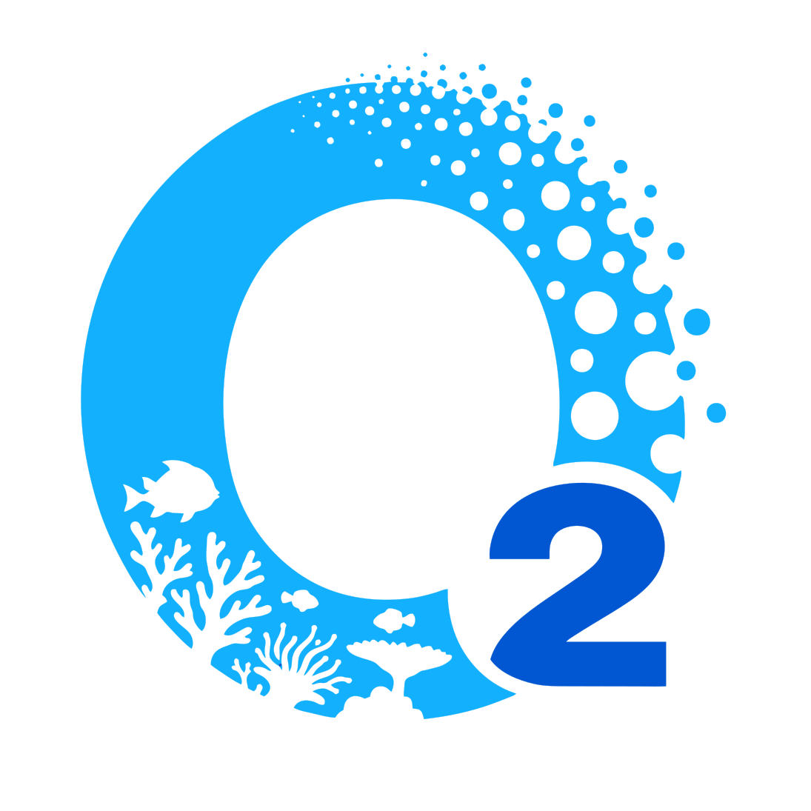
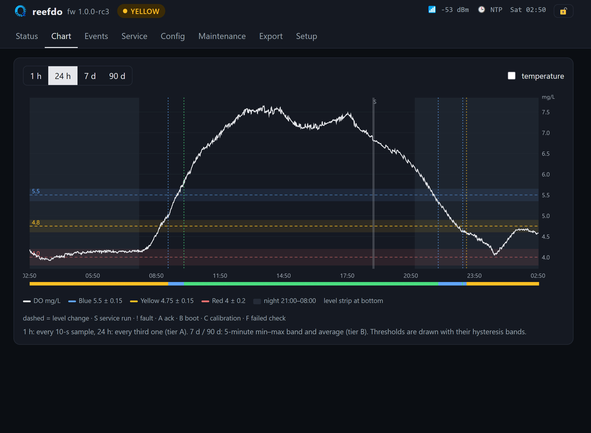
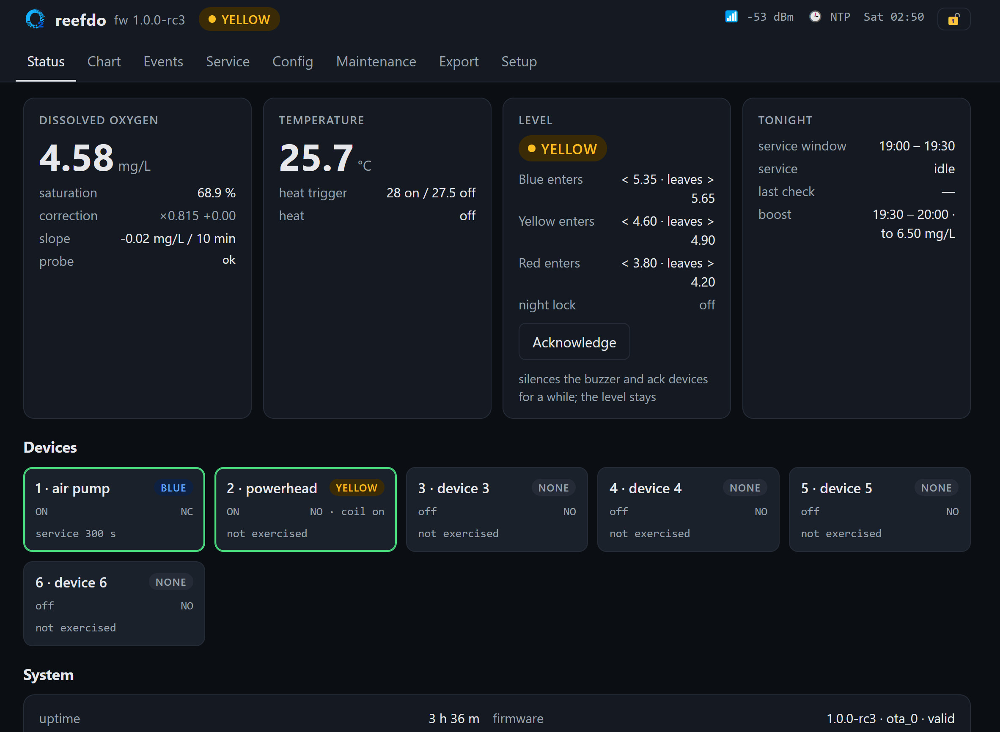
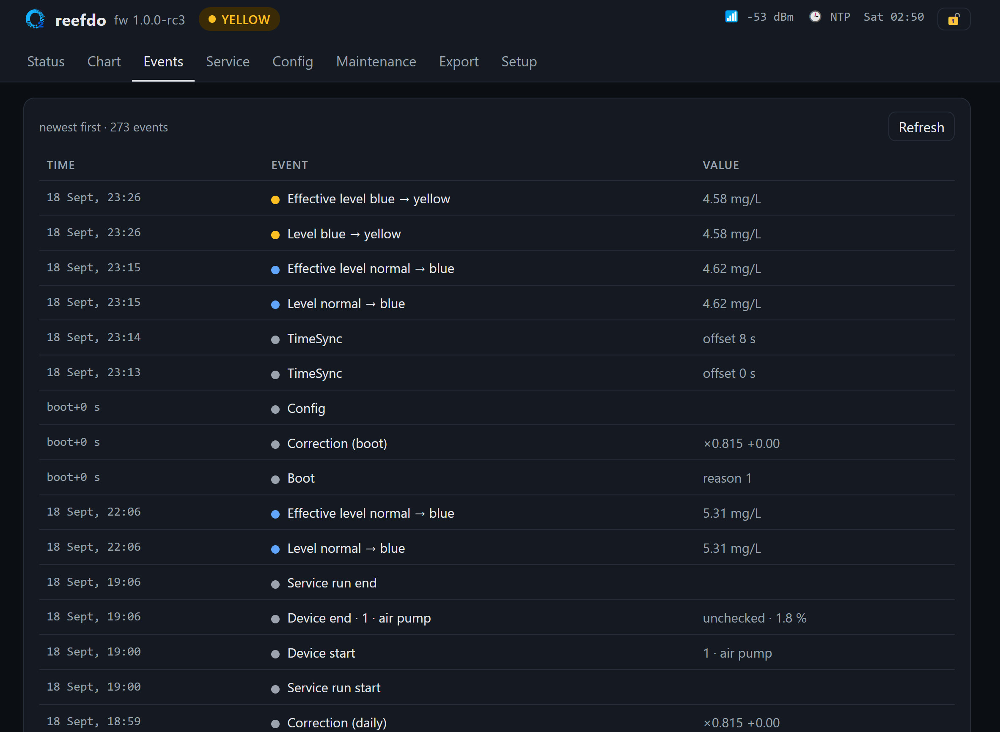
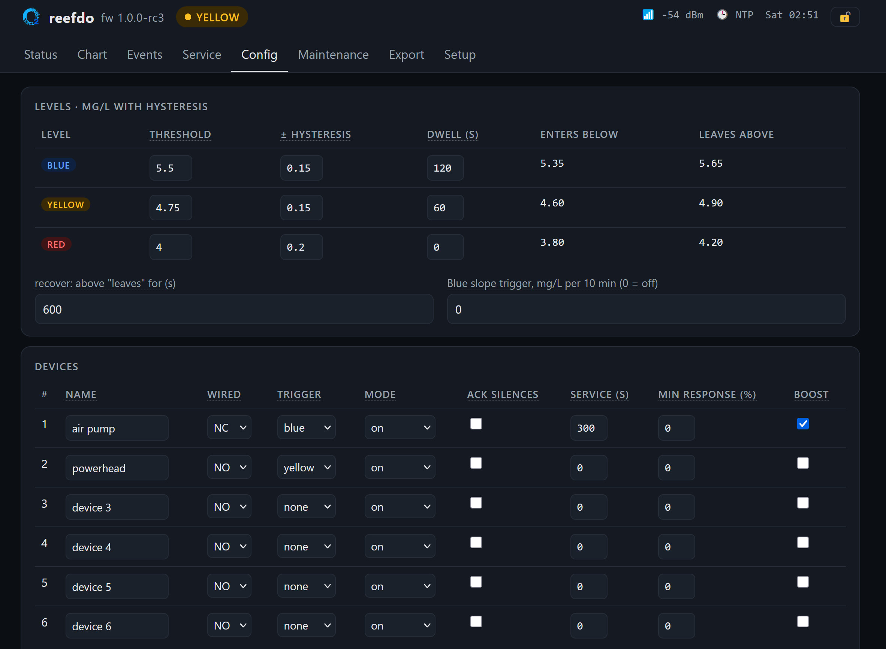

# ReefDO

[](https://github.com/PinkyDemon/ReefDO/actions/workflows/build.yml)
[](https://github.com/PinkyDemon/ReefDO/releases)

Dissolved-oxygen failsafe for a small reef aquarium. A Rika RK500-04 optical DO probe (RS485 Modbus RTU) on a
Waveshare ESP32-S3-Relay-6CH watches the water; when oxygen falls, an escalation ladder (Blue → Yellow → Red)
switches up to six relay-connected devices (air pumps, powerheads, sirens), sounds the buzzer and can send a
push notification. Everything runs on the board: logging, web UI, WiFi, time, updates. No server, no cloud.



## What it does

- Reads DO, saturation and temperature every 10 s and logs every sample (15 days full resolution, 1.7 years
  of 5-minute aggregates, events, daily summaries) on the board's flash.
- Three cumulative alert levels with mg/L thresholds, hysteresis and dwell times; each of the six devices is
  assigned to a level (or to over-temperature). NC-wired devices keep running if the controller dies.
- FAULT when the probe stops answering, freezes or reports nonsense — treated as a red-level alert.
- A daily service run in the evening exercises the failsafe devices one by one and checks that each one
  actually moves the oxygen level; a device that does not is flagged.
- An optional boost runs chosen devices inside a daily window until DO reaches a target,
  so the tank starts the night with a full buffer.
- Web UI (status, chart, events, service history, configuration, maintenance, export, setup), USB console,
  OTA updates with automatic rollback, optional push through ntfy.sh.



## Hardware

- Waveshare ESP32-S3-Relay-6CH (ESP32-S3-WROOM-1U-N16), 12 V supply on `DC +/−`.
- RK500-04 probe: red/black (power) on the same `DC +/−` terminals, yellow (A) → `A+`, green (B) → `B−`,
  white (analog out) unused.
- Relays are dry contacts; loads have their own power. Wire aeration to the **NC** contact so it runs when
  the controller is off.

## Ready-made firmware

Every tagged version is built on GitHub and published under [Releases](https://github.com/PinkyDemon/ReefDO/releases):

- `reefdo-vX.Y.Z-flash.bin` — a complete image for a new board. Connect the USB-C port and write it at 0x0 with
  [esptool](https://docs.espressif.com/projects/esptool/): `esptool --chip esp32s3 write-flash 0x0 reefdo-vX.Y.Z-flash.bin`
- `reefdo-vX.Y.Z-ota.bin` — the update image. Maintenance → OTA upload on the web page, or `POST /api/ota`.
  The board reboots into the new image and rolls back by itself if it does not come up.

Every push runs the tests and the coverage gate on Linux, the MSVC build on Windows and the firmware build
(`.github/workflows/build.yml`); a `v*` tag matching `core/include/reefdo/version.hpp` publishes a release
(`release.yml`).

## Build

Host side (the core library and its tests): Visual Studio 2026 with the C++ workload (cl, clang-cl,
llvm-cov, ninja, lld-link), CMake ≥ 3.24.

```bat
tools\vsenv.cmd cmake --preset msvc
tools\vsenv.cmd cmake --build --preset msvc-debug
tools\vsenv.cmd ctest --preset msvc-debug
```

Coverage gate (clang-cl + llvm-cov; the build fails below 100 % lines and branches on `core/`; on Linux use the
`linux-coverage` presets with clang, llvm and ninja installed):

```bat
tools\vsenv.cmd cmake --preset clang-coverage
tools\vsenv.cmd cmake --build --preset coverage
```

Firmware: ESP-IDF v6.1 installed with Espressif's EIM. `tools\idfenv.cmd` runs a command inside that
environment.

```bat
tools\idfenv.cmd idf.py -C firmware set-target esp32s3      (once)
tools\idfenv.cmd idf.py -C firmware -p COM3 build flash monitor
```

The USB-C port is the S3's native USB-Serial-JTAG; no driver on Windows. Any 115200 terminal works if it does
not toggle DTR/RTS; `idf.py monitor` handles that (Ctrl+] exits).

## First start

1. Flash, connect the probe and the 12 V supply. The LED is white while booting, then green.
2. On the console: `wifi <ssid> <password>`. Or join the open access point **reefdo-setup** and use
   http://192.168.4.1/ → Setup. Once on your network the page is at http://reefdo.local/.
3. Open the page, sign in (🔒 in the header, user `reef`, password `reefdo`) and change the password on Setup.
4. Config: name the devices, set `wired` (NC/NO), assign each to a level, set `service (s)` for the ones the
   evening check should exercise. Save.
5. Probe: set `salinity (psu)` to your tank's value, put the seawater hint into `correction scale` if the probe
   reports freshwater-referenced mg/L (a bucket of aerated tank water should read ~100 % saturation; if it
   reads well above, do an air calibration from the Maintenance page).

Every setting on the Config page has a tooltip.

## Using it

- **Status**: live values, level, devices, service state. **Acknowledge** silences the buzzer and any
  ack-silenced device for a while; it never lowers the level.
- **Chart**: 1 h / 24 h / 7 d / 90 d with thresholds, night hours, and event markers (hover them).
- **Maintenance**: mutes the buzzer for 30 min and enables relay tests, air calibration and OTA upload.
- **Export**: CSV of everything, incrementally since the last export.
- **LED**: green steady = OK online, green blinking = OK offline, blue 1 Hz / yellow 2 Hz / red 4 Hz =
  alert, blue/red alternating = FAULT, cyan = maintenance, white pulse = service run, purple flash = a
  device failed its last check.
- **BOOT button**: short press = acknowledge, hold 3 s = maintenance on/off.

|  |  |
|:--:|:--:|
| Events: every level change, service step and boot with its value | Config: every setting with a tooltip; saved and applied in one step |

### Console

| Command | |
|---|---|
| `status [json]` | values, level, devices, service, log counts |
| `ack` · `maint on\|off` · `service run` · `cal air` | as on the page |
| `relay <1..6> on\|off\|auto` | device override (maintenance only) |
| `config get` · `config set <json>` · `config reset` | partial documents are fine; `'single quotes'` become `"` |
| `time [unix [tz]]` · `wifi …` · `passwd <new>` · `passwd reset` · `ntfy test` | |
| `buzzer test <pattern> <vol> [hz] [s]` · `buzzer mute\|unmute` | try patterns · mute for testing |
| `probe sim\|rk500` | run on a simulated tank instead of the probe (after reboot) |
| `debug sim …` · `debug uart mute\|corrupt\|ok` · `debug hang` | fault injection |
| `export [since]` · `events [since]` · `reboot` · `factory yes` | |

### HTTP API

Reads are open; writes need Basic auth (`reef` / your password), e.g. `curl -u reef:… `.

| | |
|---|---|
| `GET /api/status` · `/api/service` · `/api/config` · `/api/sys` | JSON |
| `PUT /api/config` | full or partial document, validated |
| `POST /api/cmd` | `{"ack":true}` · `{"maintenance":b}` · `{"service":"run"}` · `{"cal":"air"}` · `{"relay":{"device":n,"on":b\|null}}` · `{"time":{"unix":s,"tz":s}}` |
| `GET /api/series?tier=A\|B&from&to&every` · `/api/events?since` · `/api/export.csv?since` | CSV |
| `POST /api/wifi` · `/api/passwd` · `/api/ota` · `/api/ntfy-test` · `/api/buzzer-test` | |

## Configuration keys

`sample_period_s`, `levels.{blue,yellow,red}.{mgl,hysteresis,dwell_s}`, `levels.blue.slope_mgl_per_10min`,
`recover_sustain_s`, `night.{start,end,lock,unknown_time_is_night}`, `pulse.{s,min_interval_s}`,
`heat.{on_c,off_c}`, `fault.{consecutive_failures,stuck_minutes,level,alert}`, `ack_silence_s`,
`escalate_if_failed`, `devices."1".."6".{name,wired,trigger,mode,ack_silences,service_s,min_response_pct,boost}`,
`service.{window,settle_s,tail_s,min_headroom_pct,inconclusive_days,chirp,induce_deficit_s,induce_deficit_device}`,
`boost.{enabled,window,target_mgl}`,
`correction.{scale,offset}`, `salinity_psu`, `allow_zero_cal`, `ntfy.{enabled,topic,min_level}`,
`signals.{buzzer_hz,led_brightness,normal,blue,yellow,red,fault}` with `{buzzer,volume}` per state.

## Layout

```
core/       hardware-independent C++23 library (modbus, probe, filters, ladder, service, boost, log, config, api, app, sim)
  tests/    Catch2 tests, property tests, scenario runner on the virtual tank
firmware/   ESP-IDF project: main/ (board, hal/, sampler, indicator, console, net, web + www/, notify)
assets/     logo (SVG, embedded in the firmware and served at /logo.svg) and README screenshots
third_party/  Catch2, ArduinoJson (vendored)
tools/      vsenv.cmd, idfenv.cmd, idf-shell.ps1, format.cmd
```

## Licence

MIT, see [LICENSE](LICENSE). No warranty of any kind: test it on your own tank and keep a failsafe that does not
depend on it. Third-party code: Catch2 (Boost Software License 1.0, tests only), ArduinoJson (MIT), ESP-IDF
and its components (Apache-2.0; FreeRTOS MIT), espressif/led_strip and espressif/mdns (Apache-2.0).
