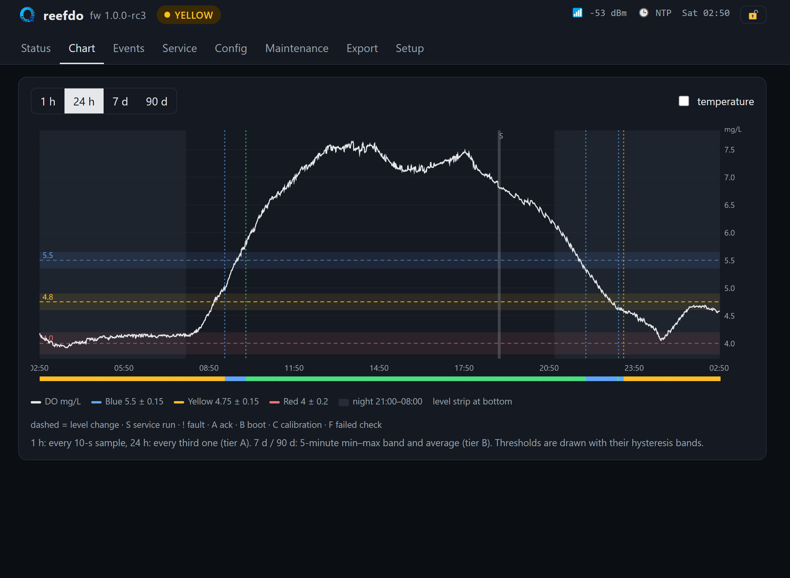
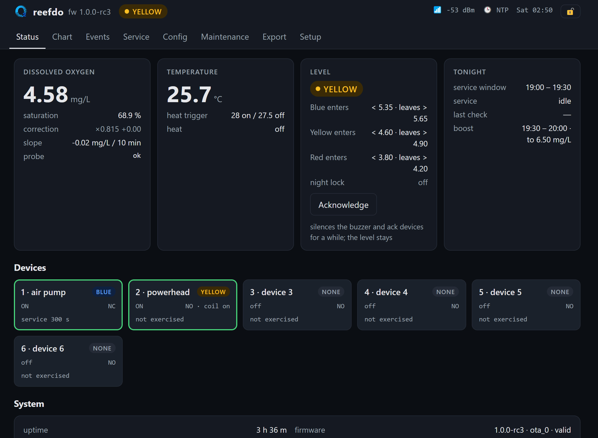
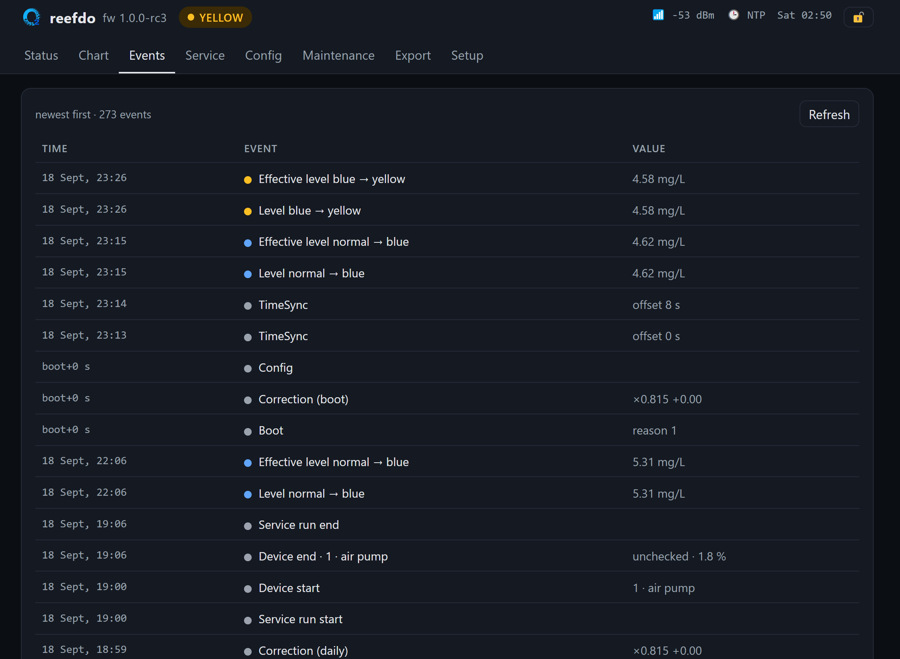
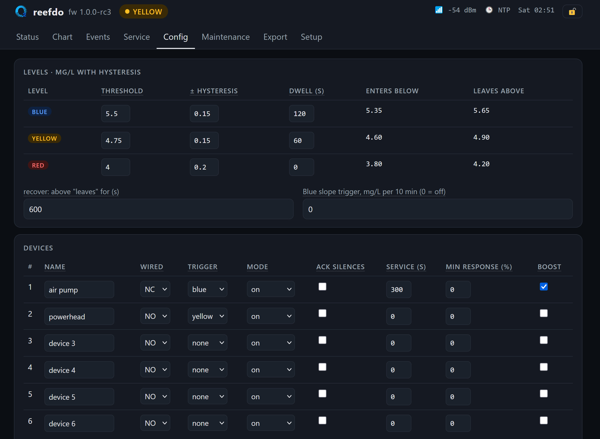

# ReefDO

[](https://github.com/PinkyDemon/ReefDO/actions/workflows/build.yml)
[](https://github.com/PinkyDemon/ReefDO/releases)

Dissolved-oxygen failsafe for a small reef aquarium. A Rika RK500-04 optical DO probe (RS485 Modbus RTU) on a
Waveshare ESP32-S3-Relay-6CH watches the water; when oxygen falls, an escalation ladder (Blue → Yellow → Red)
switches devices (air pumps, powerheads, sirens) on its six relays or on Tuya Wi-Fi plugs, sounds the
buzzer and, with the optional phone app, pushes the alarm to your phone. Everything runs on the board: logging,
web UI, Wi-Fi, time, updates. No server of your own; the phone app goes through Espressif's RainMaker cloud, and
nothing on the board depends on it.



## What it does

- Reads DO, saturation and temperature every 10 s and logs every sample (15 days full resolution, 1.7 years
  of 5-minute aggregates, events, daily summaries) on the board's flash.
- Three cumulative alert levels with mg/L thresholds, hysteresis and dwell times; each device is assigned to
  a level. NC-wired devices keep running if the controller dies. Temperature is measured and logged, not
  controlled: ReefDO is an oxygen failsafe, not an aquarium controller.
- FAULT when the probe stops answering, freezes or reports nonsense: it shows as FAULT and runs the devices of
  `fault.level` (Red by default). Otherwise only the level the readings support decides what runs and sounds —
  there is no hidden escalation.
- A sudden drop is suspect: a fall steeper than `sudden_drop.slope_mgl_per_10min` (default 3 mg/L per 10 min,
  measured over 2 min) is faster than tank water can lose oxygen — a snail or a bubble on the probe can. Until
  the reading is back above every entry threshold, every level waits `sudden_drop.extend_s` (default 10 min)
  longer than its dwell. It is logged, shown in the header and shaded on the chart.
- By day (outside the night hours) alarms can sound as at night, acknowledge themselves after 10 s, or stay
  silent (`night.day_alarm`); the level, its devices and the pushes are the same. The night always sounds.
- A daily self test in the evening exercises the failsafe devices one by one and checks that each one
  actually raises the oxygen level above the tank's own trend; a device that does not is flagged and pushed (the
  flag changes nothing that runs; clear it on the Test page or the device card once the device is fixed). A fall
  never counts: an air pump in supersaturated water strips oxygen, which says nothing about a low night, and for
  an oxygen diffuser it would be a failure. A run first needs 10 minutes of readings to know the trend, so after a
  boot or a probe gap it waits. A miss that started at or above
  `test.no_fail_above_mgl` (default 6.1 mg/L, ~90 % saturation) is logged as unchecked with the reason, not as
  FAIL: near saturation a working aerator can barely move DO.
- An optional boost runs chosen devices inside a daily window until DO reaches a target,
  so the tank starts the night with a full buffer.
- Up to four daily always-on windows per device (a skimmer that runs all day but at night only in an alert),
  and a manual auto / on / off control on every device card. A device is on while anything wants it: its
  level, the test, the boost, a window; switched on or off by hand it stays so until the next scheduled or
  triggered change.
- A device registry: eight devices by default (`DEVICES` in `core/include/reefdo/devices.hpp`), each with its
  own output slot — one of the six relays or a Tuya Wi-Fi plug over the local network (protocol 3.3, 3.4, 3.5;
  no Tuya cloud at runtime). No two devices share an output. A plug that stops answering is logged and pushed.
- Device maintenance takes one device out of order for a while (cleaning the skimmer): it stays off even in an
  alert. It is separate from ReefDO maintenance, which is for work on the controller itself.
- Web UI (status, chart, events, test history, configuration, maintenance, export, setup), USB console,
  OTA updates with automatic rollback.
- Optional phone app (ESP RainMaker Home, through Espressif's RainMaker Neo cloud): DO, level and a chart from
  anywhere, alarm pushes, and acknowledge or suspend an alert — see [Phone app](#phone-app). The board never
  depends on it: without the app, or with the cloud down, everything above works the same.
- Alert suspend for a false alarm (a snail on the probe): the alert's devices and alarm go back to Normal for
  5–60 min while the level, the log and the chart carry on; a deeper level, a FAULT or the end of the alert
  resumes it.



## Hardware

- Waveshare ESP32-S3-Relay-6CH (ESP32-S3-WROOM-1U-N16), 12 V supply on `DC +/−`.
- RK500-04 probe: red/black (power) on the same `DC +/−` terminals, yellow (A) → `A+`, green (B) → `B−`,
  white (analog out) unused.
- Relays are dry contacts; loads have their own power. Wire aeration to the **NC** contact so it runs when
  the controller is off.
- Optional: Tuya Wi-Fi plugs (Smart Life and compatible) for more loads — see [Tuya plugs](#tuya-plugs).

## Ready-made firmware

Every tagged version is built on GitHub and published under [Releases](https://github.com/PinkyDemon/ReefDO/releases):

- `reefdo-vX.Y.Z-flash.bin` — a complete image for a new board. Connect the USB-C port and write it at 0x0 with
  [esptool](https://docs.espressif.com/projects/esptool/): `esptool --chip esp32s3 write-flash 0x0 reefdo-vX.Y.Z-flash.bin`.
  It also overwrites the settings (Wi-Fi, password, configuration); the logs and a linked phone app stay.
- `reefdo-vX.Y.Z-ota.bin` — the update image. Maintenance → OTA upload on the web page, or `POST /api/ota`.
  The board reboots into the new image and rolls back by itself if it does not come up.
- `reefdo-vX.Y.Z-partition-table.bin` — the partition table alone, for a board from before 1.1.0-rc4 that should
  link the phone app (see [Boards from before 1.1.0-rc4](#boards-from-before-110-rc4)).

Every push runs the tests and the coverage gate on Linux, the MSVC build on Windows and the firmware build
(`.github/workflows/build.yml`); a `v*` tag matching `core/include/reefdo/version.hpp` publishes a release
(`release.yml`).

## Build

Host side (the core library and its tests): Visual Studio 2026 with the C++ workload (cl, clang-cl,
llvm-cov, ninja, lld-link), CMake ≥ 3.24.

```bat
tools\vsenv.cmd cmake --preset msvc
tools\vsenv.cmd cmake --build --preset msvc-debug
tools\vsenv.cmd ctest --preset msvc-debug
```

Coverage gate (clang-cl + llvm-cov; the build fails below 100 % lines and branches on `core/` and `gateway/`; on Linux use the
`linux-coverage` presets with clang, llvm and ninja installed):

```bat
tools\vsenv.cmd cmake --preset clang-coverage
tools\vsenv.cmd cmake --build --preset coverage
```

Firmware: ESP-IDF v6.1 installed with Espressif's EIM. `tools\idfenv.cmd` runs a command inside that
environment.

```bat
tools\idfenv.cmd idf.py -C firmware set-target esp32s3      (once)
tools\idfenv.cmd idf.py -C firmware -p COM3 build flash monitor
```

The first build needs internet and git: besides the registry components it downloads the ESP RainMaker Neo
firmware SDK (pinned, checked, patched; `firmware/cmake/neo_sdk.cmake`) and the MQTT libraries the SDK clones into
`firmware/external/`, about 40 MB. Later builds reuse them.

The USB-C port is the S3's native USB-Serial-JTAG; no driver on Windows. Any 115200 terminal works if it does
not toggle DTR/RTS; `idf.py monitor` handles that (Ctrl+] exits).

### Simulator

`reefdo_sim` (built with the host preset: `out\msvc\sim\Debug\reefdo_sim.exe`) runs the real App, gateway and
web page on this computer, on a virtual tank whose nights dip into Blue and Yellow:

```bat
out\msvc\sim\Debug\reefdo_sim.exe --speed 60
```

- http://localhost:8080/ is the ReefDO page, exactly as on the board (sign in with `reefdo`); http://localhost:8080/sim
  has the tank's controls. The same commands work in the terminal (`help`).
- Time runs `--speed` times faster (`speed`, `skip <min>`, `until HH:MM`); the chart, the events and the test
  history fill up as they would on the board.
- False alarms and real trouble on demand: `snail <pct> <min>` (the probe reads low), `bubble`, `drop <pct> <min>`
  (the tank falls, as real trouble does), `sat <pct>` (a step),
  `stall on` (the return pump stops moving water), `night <pct/h>` (oxygen demand), `k <device> <per_h>` (a device
  gets weaker), `probe dropout|stuck|garbage|crc <n>`.
- The phone app is simulated too: the real cloud agent runs against a fake cloud. `status` (and the `/sim` page)
  show what the app would show and every push; `phone ack` and `phone suspend <min>` are the app's two buttons;
  `cloud down` / `cloud up` cut the link.
- The logs, configuration, password and test history live in `--data` (default `reefdo-sim-data`) with the
  board's flash layout, so a run can be stopped and continued; `--fresh` starts over. `--lan` lets a phone on the
  network open it; `--port` picks another port.

### QEMU

`tools\qemu.cmd` builds the real firmware for Espressif's QEMU (`firmware\build-qemu`, `sdkconfig.defaults` plus
`sdkconfig.qemu`) and runs it: the page is at http://localhost:8096/ (another port: `tools\qemu.cmd 8097`), the
console is the window (Ctrl+A X quits). QEMU's emulated Ethernet stands in for the Wi-Fi, the virtual tank for the
probe; there is no Bluetooth, LED or buzzer, and the phone app stays *not linked*. It proves the image boots and
runs; it is no substitute for a board.

## First start

1. Flash, connect the probe and the 12 V supply. The LED is white while booting, then green.
2. On the console: `wifi <ssid> <password>`. Or join the open access point **reefdo-setup** and use
   http://192.168.4.1/ → Setup. Once on your network the page is at http://reefdo.local/.
3. Open the page, sign in (🔒 in the header, user `reef`, password `reefdo`) and change the password on Setup.
4. Config: name the devices, pick each one's output (a relay with its channel and NC/NO wiring, or a Tuya
   plug), assign each to a level, set `test (s)` for the ones the evening check should exercise. Save.
5. Probe: set `salinity (psu)` to your tank's value, put the seawater hint into `correction scale` if the probe
   reports freshwater-referenced mg/L (a bucket of aerated tank water should read ~100 % saturation; if it
   reads well above, do an air calibration from the Maintenance page).

Every setting on the Config page has a tooltip.

## Using it

- **Status**: live values, level, devices, test state. **Acknowledge** silences the buzzer and any
  ack-silenced device for a while; it never lowers the level. **Suspend alert** (5–60 min) is for a false alarm —
  a snail on the probe: the alert's devices and alarm go back to what they do at Normal, while the level, the
  log and the chart carry on. Only during an alert, never in a FAULT; a deeper level, a FAULT or the end of the
  alert resumes it early (logged, shaded on the chart). Windows, the test, the boost and manual switches are not
  alert-driven and keep running. The header adds *silent by day*, *sudden drop* and *alert suspended* when they
  apply.
- **Chart**: 1 h / 6 h / 12 h / 24 h / 7 d / 90 d with thresholds, night hours, and event markers (hover them).
- **Maintenance** has two separate parts:
  - **ReefDO maintenance** (work on the controller): maintenance mode mutes the buzzer and enables air
    calibration and OTA upload for 30 min, then ends by itself (logged; the page counts down; entering it again
    restarts the 30 min), so a forgotten maintenance cannot keep the alarm quiet. The device test there switches a device on by hand for 5 s — the manual
    switch, on and then auto.
  - **Device maintenance** (work on a device): takes one device out of order for 5–120 min, no mode needed. It
    stays off whatever wants it on, alerts included, until the time runs out or you put it back; the alarm
    itself is untouched. It lives in RAM: a reboot or power loss puts every device back in order (an NC device
    runs again), so unplug anything you put your hands into.
- **Manual control**: *auto / on / off* on a device card. *On* or *off* holds until the device's next scheduled
  or triggered change takes over — a window opening or closing, the level changing, the test reaching it, an
  exclusive test starting — and then it is *auto* again. *Off* by hand also stops a device an alert wants on,
  until the level changes; the card says "off by hand · wanted: ladder" meanwhile. Refused while an exclusive
  test runs.
- **Export**: CSV of everything, incrementally since the last export.
- **LED**: green steady = OK online, green blinking = OK offline, blue 1 Hz / yellow 2 Hz / red 4 Hz =
  alert, blue/red alternating = FAULT, cyan = maintenance, white pulse = test run, purple flash = a
  device failed its last check.
- **BOOT button**: short press = acknowledge, hold 3 s = maintenance on/off.

|  |  |
|:--:|:--:|
| Events: every level change, test step and boot with its value | Config: every setting with a tooltip; saved and applied in one step |

### Console

| Command | |
|---|---|
| `status [json]` | values, level, devices, test, log counts |
| `ack` · `alerts suspend [min]` · `alerts resume` · `maint on\|off` · `test run` · `test clear <device>` · `cal air` | as on the page |
| `suspend <device> <min>\|off` | device maintenance: out of order (≤ 120 min) |
| `manual <device> on\|off\|auto` | manual control |
| `tuya` · `tuya test <device> on\|off` | the plugs and their links · one switch now, with the error spelled out |
| `config get` · `config set <json>` · `config reset` | partial documents are fine; `'single quotes'` become `"` |
| `time [unix [tz]]` · `wifi …` · `passwd <new>` · `passwd reset` | |
| `buzzer test <pattern> <vol> [hz] [s]` · `buzzer mute\|unmute` | try patterns · mute for testing |
| `cloud` · `cloud link` · `cloud forget yes` | the phone app: its state · open the Bluetooth link window · unlink (erases the certificate; the next link uses up one of the account's 20 node IDs) |
| `probe sim\|rk500` | run on a simulated tank instead of the probe (after reboot) |
| `debug sim …` · `debug uart mute\|corrupt\|ok` · `debug hang` | fault injection |
| `export [since]` · `events [since]` · `reboot` · `factory yes` | |

### HTTP API

Reads are open; writes need Basic auth (`reef` / your password), e.g. `curl -u reef:… `.

| | |
|---|---|
| `GET /api/status` · `/api/test` · `/api/config` · `/api/sys` | JSON |
| `GET /api/slots` | every output type's parameters as JSON Schema (titles, help, limits, defaults) |
| `PUT /api/config` | full or partial document, validated |
| `POST /api/cmd` | `{"ack":true}` · `{"suspend_alerts":{"s":secs,"level":shown}}` (`0` resumes; refused if the level is now deeper than `level`) · `{"maintenance":b}` · `{"test":"run"}` · `{"cal":"air"}` · `{"suspend":{"device":n,"s":secs}}` (`0` puts it back) · `{"manual":{"device":n,"on":b|null}}` (`null` = auto) · `{"clear":{"device":n}}` (a failed test verdict) · `{"time":{"unix":s,"tz":s}}` |
| `GET /api/series?tier=A\|B&from&to&every` · `/api/events?since` · `/api/export.csv?since` | CSV |
| `POST /api/wifi` · `/api/passwd` · `/api/ota` · `/api/buzzer-test` · `/api/mute` · `/api/cloud-link` | |

## Configuration keys

`sample_period_s`, `levels.{blue,yellow,red}.{mgl,hysteresis,dwell_s}`, `levels.blue.slope_mgl_per_10min`,
`recover_sustain_s`, `night.{start,end,lock,unknown_time_is_night,day_alarm}` (`day_alarm`: `sound` (default),
`auto_ack` or `suppress`), `sudden_drop.{slope_mgl_per_10min,extend_s}` (default 3 and 600; the slope must be
steeper than Blue's slope trigger, 0 = off; `extend_s` 0..3600), `pulse.{s,min_interval_s}`,
`fault.{consecutive_failures,stuck_minutes,level,alert}`, `ack_silence_s`,
`devices."1".."8".{name,slot,trigger,mode,ack_silences,test_s,min_response_pct,boost,windows}`
(slot: the device's output, `{"type":"none"}`, `{"type":"relay","channel":1..6,"wiring":"NO"|"NC"}` or
`{"type":"tuya","id","ip","key","version":"3.3"|"3.4"|"3.5","dp":1..255}` — `GET /api/slots` lists every type's
parameters; no two devices share a relay or a plug outlet, and a device with a trigger, test, boost or window
needs one; another type starts from that type's defaults; by default device N is on relay N, and a 1.0 document
with `wired` at the device loads that way; windows: up to 4 `["HH:MM","HH:MM"]` pairs, wrapping midnight when the
end is earlier; not for pulse or alarm devices),
`test.{window,settle_s,tail_s,min_headroom_pct,inconclusive_days,chirp,induce_deficit_s,induce_deficit_device,exclusive,no_fail_above_mgl}`
(`exclusive`, default on: during a run only the tested device runs; off: devices are still exercised but nothing
is measured or judged; `no_fail_above_mgl`, default 6.1, 0 = off: a device that misses its response after
starting at or above this DO is unchecked, not FAIL; a stored document with the old `service` / `service_s`
names still loads),
`boost.{enabled,window,target_mgl}`,
`correction.{scale,offset}`, `salinity_psu`, `allow_zero_cal`,
`signals.{buzzer_hz,led_brightness,normal,blue,yellow,red,fault}` with `{buzzer,volume}` per state.

## Phone app

ReefDO can report to the **ESP RainMaker Home** app (Android, iOS) through Espressif's **RainMaker Neo** cloud.
The app shows DO, saturation and temperature (5-minute medians), the level, a status line
("Yellow · 4.31 mg/L · sudden drop") and the last hour, 12 h, 24 h and 7 days as rows of bars, pushes the alarm to
the phone, and can do exactly two things:
**acknowledge** and **suspend the alert** (0–60 min). Configuration, maintenance and everything else stay on the
local page. The board never depends on it: not linked, offline or with the cloud down, it runs exactly as it does
without the app. Setup and `/api/sys` show *off*, *not linked*, *linking*, *offline* or *online*.

### Linking a board

You need the board on 1.1.0-rc4 or later with the current partition table (a board from before: see below), your
phone within a few metres of it with Bluetooth on, and the ESP RainMaker Home app set to **RainMaker Neo**,
signed in with a Neo account. In its Classic mode the app links the board to the older RainMaker cloud instead:
that seems to work, but the device never comes online.

1. On ReefDO's page sign in, open Setup → **Phone app** → **Link to the phone app** (or `cloud link` on the
   console). It shows the board's Bluetooth name — `PROV_ReefDO` and four hex digits, e.g. `PROV_ReefDO1a2b` —
   and an eight-character code. The board listens for 10 minutes.
2. In the app: **+** → **I don't have a QR code**. It scans Bluetooth and lists the board under that name, with a
   light-bulb icon (the app's default for a kind of device it does not know). Pick it.
3. Type the code when the app asks for it.
4. Pick the Wi-Fi network ReefDO should use and type its password. The board keeps it as its own Wi-Fi, as if
   set on Setup.
5. The app confirms the node, the Wi-Fi and the setup. A red *Current TimeZone is not set* at the last step is
   harmless: the device is added, ReefDO keeps its own time zone. **Continue** — ReefDO is under *My Devices*,
   and Setup shows *online*.

**While the window is open the board is off Wi-Fi** (the provisioning takes the radio over): the page does not
answer and Tuya plugs cannot be switched until it closes; the ladder, the relays and the buzzer carry on. If
nobody links, the window closes after 10 minutes, the board is back on its Wi-Fi, and a new window can be opened.

### In the app

| | |
|---|---|
| **DO (mg/L)**, **Saturation (%)**, **Temperature** | 5-minute medians. Temperature also opens the app's chart, but that shows only daily, weekly and monthly averages — the trend rows below show the curve. The device card on the home screen shows the temperature. |
| **Level**, **Status** | at once on every change, e.g. "Red · 3.92 mg/L · sudden drop · silenced" |
| **Acknowledge** | press and hold: the same as Acknowledge on the page |
| **Suspend alert (min)** | 5–60 suspends the current alert, 0 resumes it. Outside an alert, in a FAULT, or when the level is now deeper than the app showed, the board refuses and the slider goes back |
| **Last hour**, **Last 12 h**, **Last 24 h**, **Last 7 days** | the curve the app's charts cannot show (they draw only daily, weekly and monthly averages), as a row of bars: `▇▇▆▅▄▃▃▄▅▆▇… low 4.31 at 03:40 · high 7.02`. One bar per 2.5 min, 30 min, 1 h or 6 h, each the lowest DO in it, on a fixed scale from 0.5 mg/L below Red (`▁`) to 2.5 above Blue (`█`), so a dip into an alert looks like one and a calm day stays flat; `·` where there was no reading. Then the window's low with its time and its high. After a reboot they come back from the board's 5-minute log. |

Pushes come for an alert that needs a person (Yellow, Red, repeats), a FAULT, a failed evening test and a lost
plug, and once more when the board gets its connection back during a standing alarm. Their text is fixed by
Espressif's cloud — "Node ‹id› has an alert!" (the id is under the device's settings, *Node Information*) — so open
the app for the reason.

### Unlinking

Remove the device in the app, then `cloud forget yes` on the console: it erases the board's certificate and
reboots, and the board can be linked again, to the same or another account. Each linking uses up one of the
account's 20 lifetime node IDs. `factory yes` never erases the certificate.

### Boards from before 1.1.0-rc4

The device certificate lives in its own flash partition (`fctry`, 24 KB, after the logs), which older partition
tables lack; until it is there, *Link to the phone app* answers *needs the new partition table*. OTA cannot change
the table: write it
once over USB — settings, logs and test history stay — and update by OTA as usual, in either order:

```
esptool --chip esp32s3 write-flash 0x8000 reefdo-vX.Y.Z-partition-table.bin
```

The release's complete flash image would do too, but it overwrites the settings.

### When it does not work

- *No Bluetooth device found with prefix PROV_*: the link window is not open (or has closed), the phone is too
  far, or the board runs a firmware from before 1.1.0-rc4.
- An exclamation mark at *Setting up the node* and no device afterwards: the app was in Classic mode.
  `cloud forget yes`, switch the app to Neo, link again.
- Espressif runs the public Neo deployment and may change it; the board's own page and log are the record of
  truth.

## Tuya plugs

A device whose output slot is a Tuya plug switches that plug over your LAN. Each
plug outlet belongs to one device; the two outlets of a power strip are two devices with the same id and
different dps. ReefDO talks the plugs' local protocol (3.3, 3.4 or 3.5) directly on TCP 6668 — the Tuya cloud
is needed once, to learn the plug's local key, never while it runs.

1. Pair the plug with the Tuya / Smart Life app as usual and give it a fixed address (a DHCP reservation in
   your router). ReefDO does not search for it.
2. Get its **device id** and **local key**: the free [tinytuya](https://github.com/jasonacox/tinytuya) wizard
   (`python -m tinytuya wizard`, with a Tuya IoT developer account linked to your app) lists both;
   `python -m tinytuya scan` shows each plug's address and protocol **version**. Re-pairing a plug changes its
   local key.
3. Config → **Devices**: set the device's output to *Tuya plug* and fill in the fields that appear beside it —
   device id, address, local key, version and dp (the switching data point: 1 on single plugs, 1..4 on power
   strips). Save. The key is shown as `********` from then on and never leaves
   the board (the API's config document masks it too).
4. Check it: the device card shows *plug* when the last transaction worked; the console's `tuya test <n> on`
   tells you what went wrong otherwise (no connection, no answer = wrong key or version, …).

ReefDO sends every plug the state it wants when that changes and re-asserts it every minute (a plug switched
in the app, or restarted, is put right within a minute). Three failed transactions in a row mark the plug
**lost**: logged, pushed, red on its card; the first success brings it back.

**A plug is not a failsafe relay.** It keeps its last state when ReefDO, the Wi-Fi or the router goes down, and
it cannot be wired NC. Put the aeration you rely on on an NC relay; plugs are for the extras — a skimmer, a
second air pump.

## Layout

```
core/       hardware-independent C++23 library: the logic (modbus, probe, filters, ladder, selftest, boost, log, config, slot, app, sim, tuya)
  tests/    Catch2 tests, property tests, scenario runner on the virtual tank
gateway/    how every transport reaches the App: views (status, chart, events, export, config, commands), the router
            (every /api/* route, who may call what) and the phone app's agent (parameters, medians, pushes)
  tests/    its tests, in the same test binary
sim/        reefdo_sim: the App, the gateway and the page on a virtual tank, on localhost
firmware/   ESP-IDF project: main/ (board, hal/, sampler, indicator, console, net, web + www/, platform, cloud_link,
            tuya_link)
assets/     logo (SVG, embedded in the firmware and served at /logo.svg) and README screenshots
third_party/  Catch2, ArduinoJson (vendored; the firmware build downloads the ESP RainMaker Neo firmware SDK into
              firmware/external/ and applies firmware/patches/)
tools/      vsenv.cmd, idfenv.cmd, idf-shell.ps1, format.cmd, qemu.cmd
```

## Licence

MIT, see [LICENSE](LICENSE). No warranty of any kind: test it on your own tank and keep a failsafe that does not
depend on it. Third-party code: Catch2 (Boost Software License 1.0, tests only), ArduinoJson (MIT), ESP-IDF
and its components (Apache-2.0; FreeRTOS MIT), espressif/led_strip and espressif/mdns (Apache-2.0), the ESP
RainMaker Neo firmware SDK (downloaded at build time, with two small ReefDO patches in `firmware/patches/`) and its
registry components (network_provisioning, esp_schedule, rmaker_console, json_parser, json_generator:
Apache-2.0), and the esp-aws-iot libraries it builds on (coreMQTT, coreMQTT-Agent, coreJSON, backoffAlgorithm,
Jobs, MQTT file streams: MIT). The Tuya
local protocol follows the layout documented by tinytuya (MIT); no tinytuya code is included. Tuya is a
trademark of its owner; ReefDO is not affiliated with it.
